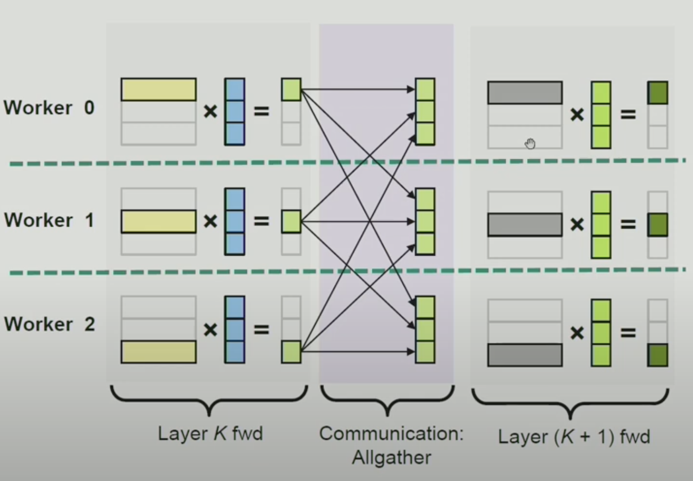
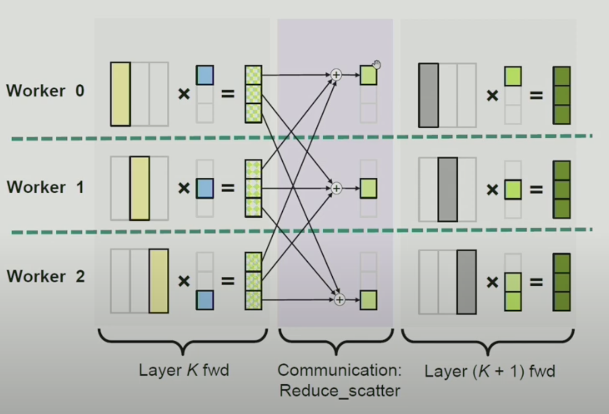
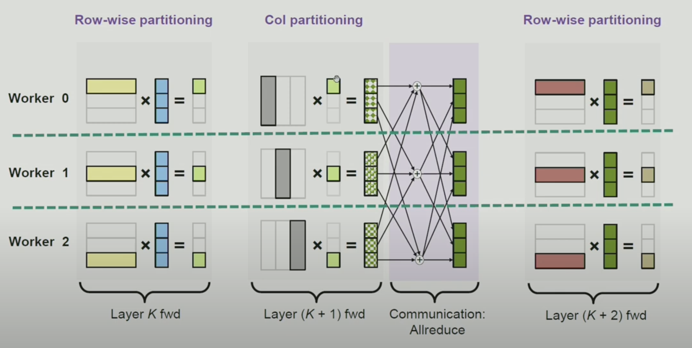

# Pipeline Optimization

## Variants

1. Row-wise partitioning
   1. Communication: All-Gather
   2. Diagram
    
2. Column-wise partitioning
   1. Communication: Reduce-Scatter
   2. Diagram
    
3. Alternating partitioning
   1. Definition: Every two consecutive layers are partitioned in different ways - row-wise followed by column-wise.
   2. Communication: All-Reduce
   3. Diagram
    

## Forward (fwd) and Backwar (bwd)

1. fwd row-wise partitioning corresponds to a bwd column-wise partitioning.
   1. fwd: All-Gather
   2. bwd: Reduce-Scatter
2. fwd column-wise partitioning corresponds to a bwd row-wise partitioning.
   1. fwd: Reduce-Scatter
   2. bwd: All-Gather

## Performances

1. Alternating partitioning reduces the communication/synchronization cost by 50% compared to row-wise partitioning or column-wise partitioning.
